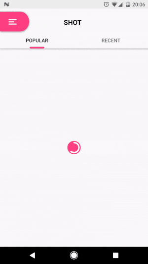
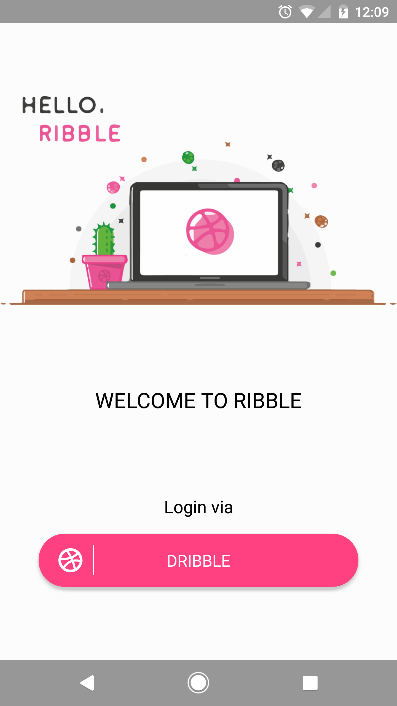
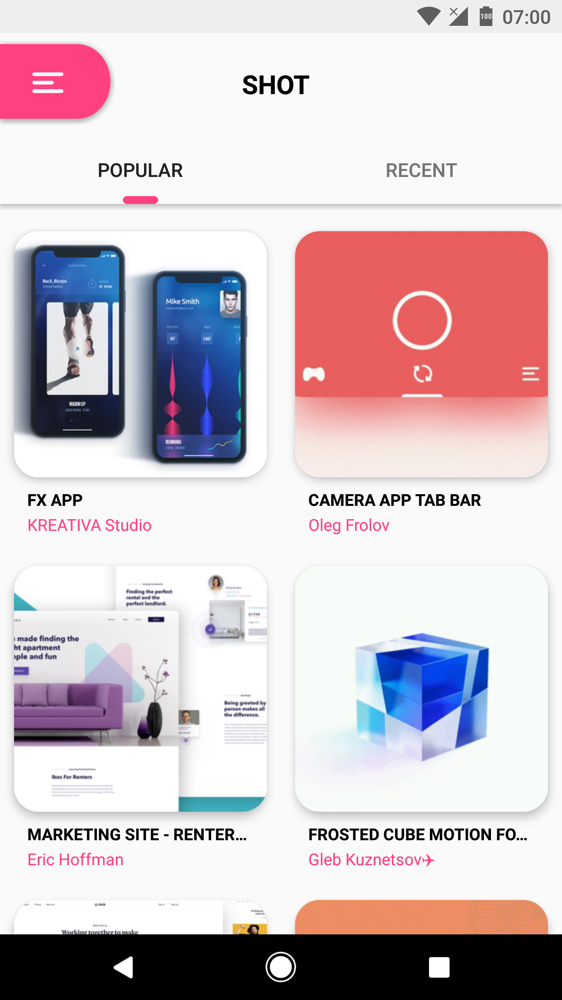
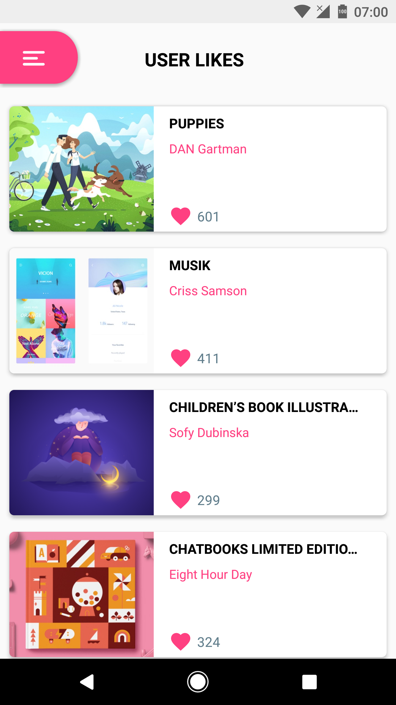
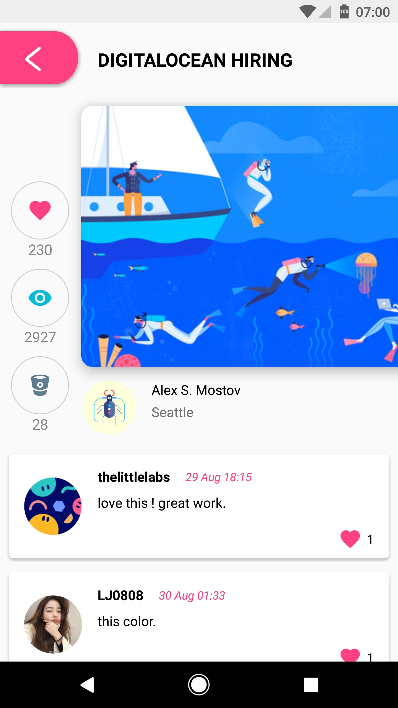
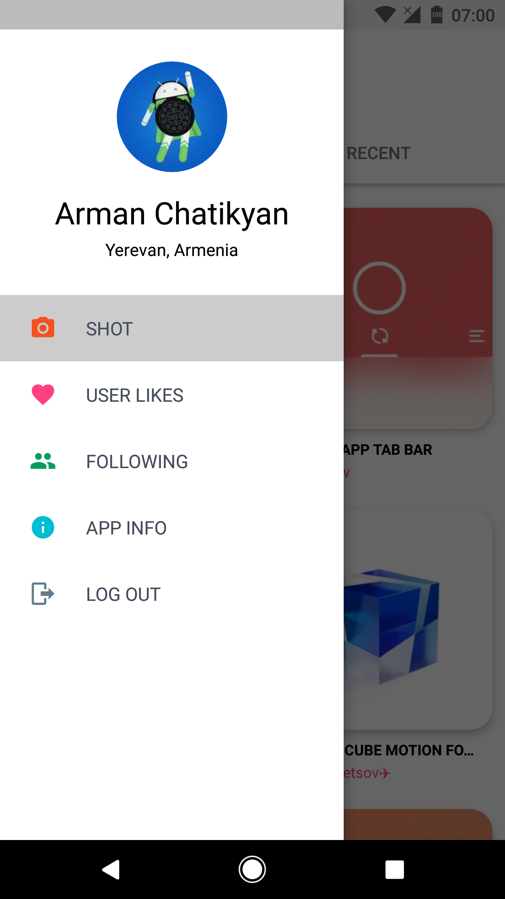
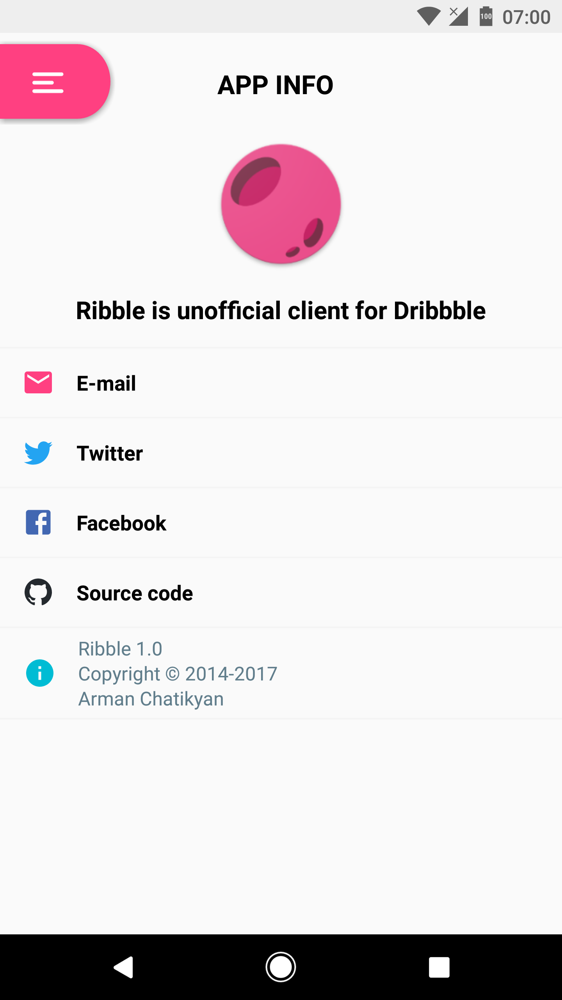

# Ribble

<p align="center">
    <a href="art/launcher.png">
        
    </a>
</p>

## Simple Dribbble Client using Dribbble API, work in progress...

## Features
:white_check_mark:  Kotlin: Yes, fully written in Kotlin(~96%). :scream: :heart: <br/>
:white_check_mark:  Clean architecture: The whole project is based on uncle Bob's clean architecture approach. <br/>
:white_check_mark:  Configuration change: Handles configuration changes <br/>
:white_check_mark:  Material Design: Not a fully Material Design App, but I am trying my best. <br/>
:white_check_mark:  Some custom views: Progress bar, navigation view, arcView, dialog...<br/>
:white_check_mark:  Usage of libraries:<br/>
   * [BaseMVP](https://github.com/armcha/MVP-Architecture-Components) - for MVP architecture<br/>
   * [Dagger 2](https://github.com/google/dagger) - for dependency injection<br/>
   * [RxJava 2, RxAndroid 2](https://github.com/ReactiveX/RxJava) - for data manipulation<br/>
   * [Architecture components](https://developer.android.com/topic/libraries/architecture/index.html) - ViewModel and LifeCycle<br/>
   * [Glide](https://github.com/bumptech/glide) - for image loading<br/>
   * [Gson](https://github.com/google/gson) - for serialization and deserialization<br/>
   * [Retrofit](https://github.com/square/retrofit) - for HTTP requests<br/>
   * [Room](https://developer.android.com/topic/libraries/architecture/room.html) - for data persistence (Not implemented yet)<br/>
   * [Leak canary](https://github.com/square/leakcanary) - for memory leak detection<br/>
   * [Logger](https://github.com/armcha/logger) - for simple logging<br/>
    
## TODO list:
:white_large_square: Adding/removing favourite shot <br/>
:white_large_square: User profile screen <br/>
:white_large_square: Data base for offline usage <br/>
:white_large_square: Fonts <br/>
:white_large_square: Endless scroll <br/>
:white_large_square: Design improvements <br/>
:white_large_square: Add unit tests & integration tests <br/> 
:white_large_square: More features using Dribbble API <br/>

### Download sample [apk](https://github.com/armcha/Ribble/blob/master/art/Ribble.apk)



## Screenshots

| Login     | Popular/Recent     | Likes     |
| :-------------: | :-------------: | :-------------: |
|  |  |  |

| Shot detail     | Nav drawer     | App info     | 
| :-------------: | :-------------: | :-------------: |
|  |  |  | 
    
## Build
### Open the project in Android Studio
```
git clone https://github.com/armcha/Ribble.git
```

### Dribbble OAuth
The App client id, client secret and client access token are placed in [gradle.properties](https://github.com/armcha/Ribble/blob/master/gradle.properties) file.<br/>
 **If the CLIENT SECRET and ACCESS TOKEN are abused, I will reset and not commit them**
 
 
## Contact

Pull requests are more than welcome.

- **Email**: chatikyana@gmail.com
- **Facebook**: https://web.facebook.com/chatikyana
- **Twitter**: https://twitter.com/ArmanChatikyan
- **Google +**: https://plus.google.com/+ArmanChatikyan
- **Website**: https://armcha.github.io/
- **Medium**: https://medium.com/@chatikyan

License
--------


      Simple Dribbble Client
      Copyright (c) 2017 Arman Chatikyan (https://github.com/armcha/Ribble).

      Licensed under the Apache License, Version 2.0 (the "License");
      you may not use this file except in compliance withLog the License.
      You may obtain a copy of the License at

         http://www.apache.org/licenses/LICENSE-2.0

      Unless required by applicable law or agreed to in writing, software
      distributed under the License is distributed on an "AS IS" BASIS,
      WITHOUT WARRANTIES OR CONDITIONS OF ANY KIND, either express or implied.
      See the License for the specific language governing permissions and
      limitations under the License.
    
